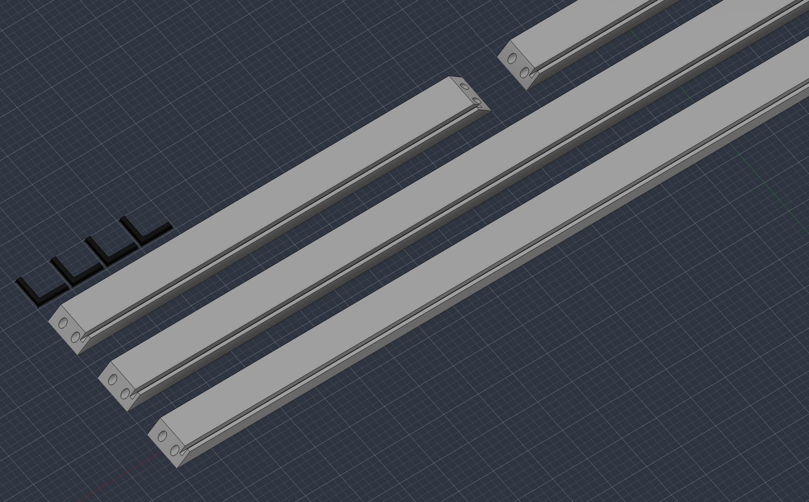
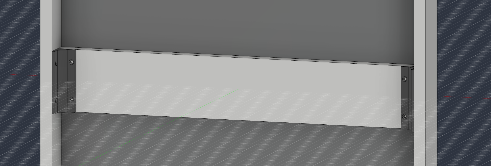

# Nova-Mirror

## Contents of this README
- Introduction
- Why did I make it?
- Core Features
- Core Structure
- Parts List
- Additional things you will need
- Build Guide
- Possible Extensions
- AI-Usage Declaration

## Introduction

Hey, I am Jakob and I need a mirror for my room, so why not make a completely overengineered one?  
This is the Nova-Mirror, a wall mirror that can display any information right on the glass as well as act as a voice controlled home assistant powered by AI.  
Read my devlog for more information!  
https://stardance.hackclub.com/projects/32034/devlogs/21031  

But why did I make it (and why should you)?

## Why did I make it?

I really like the idea of home assistants like Amazon Alexa, Apple Homepod or Google Nest, but the Google is the wrong ecosystem for me, the Apple is too expencive and as a grumpy German I don't like the fact that my voice recordings are on american servers from companies I don't really trust.  

When built into a normal piece of furniture you also don't need a seperate device which you have to find a place to sit for.

But most importantly: I wanted it to be perfect – for me. And because it is open source you can also make it perfect for you. I wanted it to do exactly what I need and look and feel premium, like a real product.

The mirror is designed to make my life easier. When standing up in the morning the first thing I do is to look into that mirror and I instantly see what I still have to do and what appointments I have today. I can also add things directly via the mirror.

The mirror is supposed to motivate me (and hopefully you) to work out more often (and go outside more often in general...) by telling me the perfect time to do so and what to wear and by tracking my progress.

## Core Features
- Widegts
    - Weather
    - Smart-Home-Thermometer
    - Apple Calender & Reminders
    - Apple Fitness & Health
    - Spotify
- Voice Control
    - Smart-Home (Lights, Blinds, Devices)
        - *Turn off my Bedroom lights*
    - *Play [Song] by [Artist] on Spotify*
- AI-Agent
    - More complex questions and tasks
- Web interface for setup and customizastion
- (being a mirror)

## Core Structure

**The Frame**

The frame is made from a single 19 mm MDF board, which needs to be cut into four pieces: two longer pieces for the sides and two shorter pieces for the top and bottom.

Each piece has two holes on both ends where the L-shaped connectors can slide in. These hold the frame together until it is secured from the inside with brackets. Every frame piece also needs a slot for the glass pane to slide into.

**Laminating the Frame**

Before assembling the frame, you need to laminate it. I recommend wrapping each piece individually before putting everything together.

**Installing the Glass Pane**

When assembling the frame, insert the glass pane before attaching the last frame piece, as the pane is held in place by the slots in the frame.

The glass pane also needs to be covered with the one-way mirror film before installation.

**Adding the Support Bracket**

After the frame has been assembled, you can install the support bracket in the middle to prevent the glass from deflecting.

Add felt pads at regular intervals between the bracket and the glass. When securing the bracket, do not press it against the glass. Instead, hold it firmly in place while fixing it.

*After the frame is built the components are either screwed or taped into the frame.*

**The complete 3D model of the Stardance Nova Mirror is available here:**

[Download the STEP file](readme_assets/NovaMirror.step)

## Parts List
*Note that the linked websites and prices are for germany.*

| Part | Specification | Price | Link |
|------|---------------|------:|------|
| (Used) Monitor | 27" | ≈€30.00 | - |
| Clear Glass Panel | 60 × 160 cm × 5 mm | €56.80 | https://www.amazon.de/MySpiegel-Glasscheibe-Glasplatte-Glasboden-Glastisch/dp/B0GKBJQ15H/ref=sr_1_5?__mk_de_DE=ÅMÅŽÕÑ&crid=1DU26M7K94PWO&dib=eyJ2IjoiMSJ9.ReZfRhB-08Y_zAL0yNHf_9tjFZuwnZz0CqHBqZnF4JhKDcSJRJIbJiIwz41vOJwihxuAP-GZSxCa8mXr7No0_uuOzY_owS01PrnSoH9bUpQi_QDaIFJylDQtM9j-LXKUrpu3QEFPk9w5ZonBHDVas76dHPgnXyPizZ8T5hgUU91dkvFQ4xLqf4Zvbetntf8XER3NRzW8byrX0FXKy5YeWQ9tAbmbgiFJrxQWdZPl5ZOvpL25faJ0EK9sIpTU3aksddkVCOmmFrmsr0oEOvSgsKX-ujUImQ3ROQYJm15gt-0.jjHjsRlF0bx6XMUgjGTQY92IUpXw6DQGEU3eZ3sjqM8&dib_tag=se&keywords=glasplatte+60x160&qid=1783438666&sprefix=glasplatte+60x160,aps,125&sr=8-5&th=1 |
| One-Way Mirror Film (incl. Application Kit) | Interior, 76 cm × 2 m + Standard Installation Kit | €38.29 | https://www.folienmarkt.de/sonnenschutzfolien-silber-80-dunkel?etcc_med=SEA&etcc_par=Google&etcc_cmp=21054437516&etcc_grp=&etcc_bky=&etcc_mty=&etcc_plc=&etcc_ctv=&etcc_bde=c&etcc_var=CjwKCAjwx7LSBhB3EiwAjcodxFn2KQ5lAyG2lgEKcSrktgwxNbTwwotzhByy7xXZ5SS6s9Yy0RNMhBoC8jQQAvD_BwE&etcc_name=cpc_google_pmax_low-performer_de-de&gad_source=1&gad_campaignid=21507364782&gbraid=0AAAAAD8_6VfvdclON86MBfm99mUnBST6r&gclid=CjwKCAjwx7LSBhB3EiwAjcodxFn2KQ5lAyG2lgEKcSrktgwxNbTwwotzhByy7xXZ5SS6s9Yy0RNMhBoC8jQQAvD_BwE |
| Raspberry Pi 4 | 4 GB RAM | €105.90 | https://www.berrybase.de/raspberry-pi-4-computer-modell-b-4gb-ram |
| MicroSD Card | 32 GB (A1) | €15.00 | https://www.berrybase.de/sandisk-ultra-microsdhc-a1-120mb-s-class-10-speicherkarte-adapter-32gb |
| USB-C Power Supply | For Raspberry Pi | €7.90 | https://www.berrybase.de/offizielles-raspberry-pi-usb-c-netzteil-5-1v-3-0a-eu-weiss |
| Power Strip | At least 2 outlets (Pi + Monitor) | €8.00 | - |
| MDF-Board | 160 × 40 cm, 16 mm / 19 mm | €15.00 | - |
| White Adhesive Vinyl | Matte White, 45 cm × 2 m | €6.99 | https://www.obi.de/p/6679401/d-c-fix-klebefolie-weiss-matt-45-cm-x-200-cm |
| Tactile Push Buttons | Pack of 5 | €0.45 | https://www.berrybase.de/kurzhubtaster-vertikale-printmontage-6x6mm-h-5-0mm |
| RCWL-0516 Radar Sensor | | €0.90 | https://www.berrybase.de/elecrow-rcwl-0516-mikrowellen-radarsensor-3600-erkennung-rcwl-9196-chip-5-9-m-4-28-v |
| USB Conference Microphone | | €10.00 | https://www.amazon.de/dp/B0GF94CDKG/ref=sspa_dk_detail_0?pd_rd_i=B0GF94CDKG&pd_rd_w=cnz66&content-id=amzn1.sym.cf5ead54-c2f4-4493-953a-430e94cae639&pf_rd_p=cf5ead54-c2f4-4493-953a-430e94cae639&pf_rd_r=FEJYWKS10KX1JGDQ5H3E&pd_rd_wg=rsCWv&pd_rd_r=6365dfc7-3379-4dcf-bfda-b798a801280e&aref=FKhV2MzKR7&sp_csd=d2lkZ2V0TmFtZT1zcF9kZXRhaWw&th=1 |

**Total: ≈€250-300** 

## Additional things you will need
- A second person to help you
- A way to cut the MDF-board in shape
- A sharp utility knife
- Wood glue
- Heatgun or Hairdryer
- Squeegee with a felt edge
- 3D-printed Parts
- Screws and Anchors
- Tools to decase the monitor
- 16mm wood screws
- Cordless Screwdriver (recommended)

## Build Guide
Sorry, this part doesn't exist yet 😖

## Possible Extensions
- Led Backlight
- Speaker for AI Answers via Text to Speech

## AI-Usage
I used AI for brainstorming on needed Parts, like how much RAM the Pi needs and which folis to use. Because I had some issues setting up Hackatime I used AI to help me.